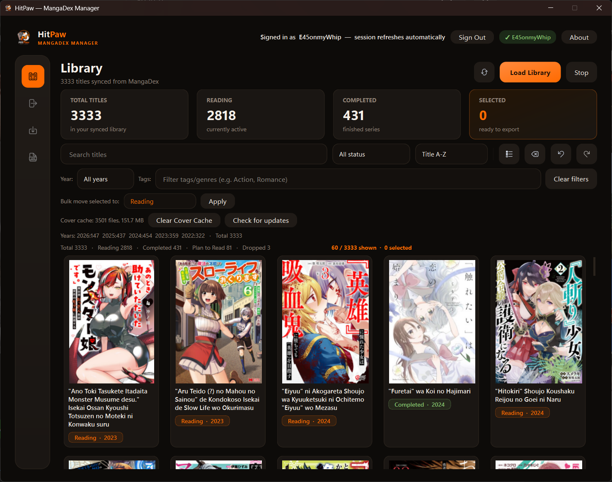
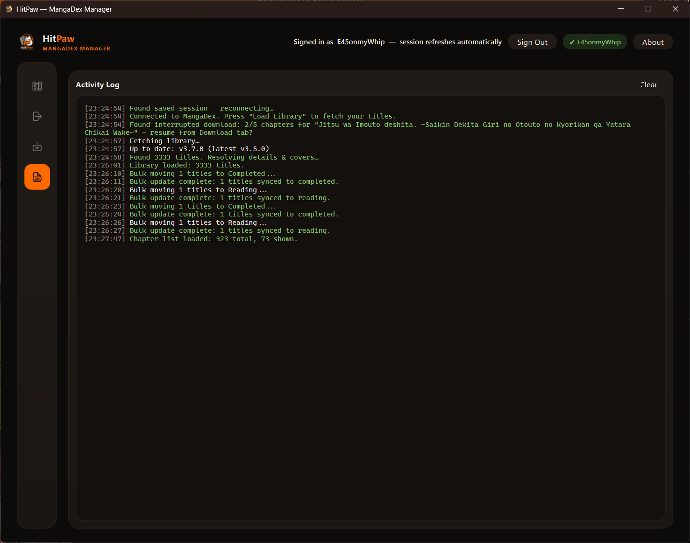
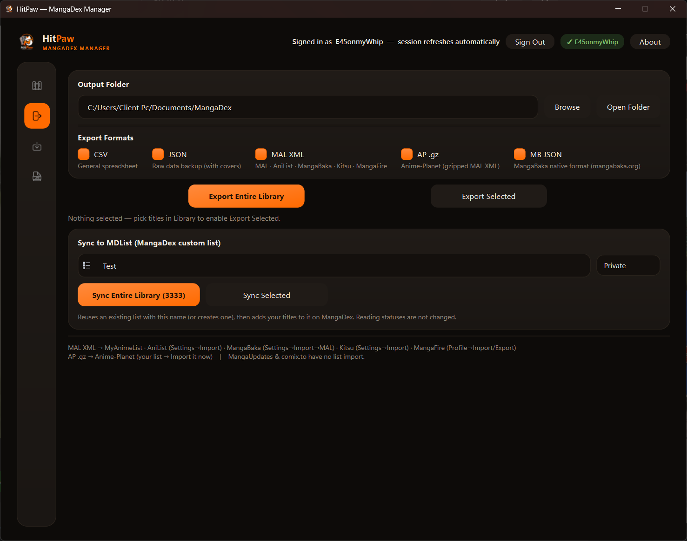
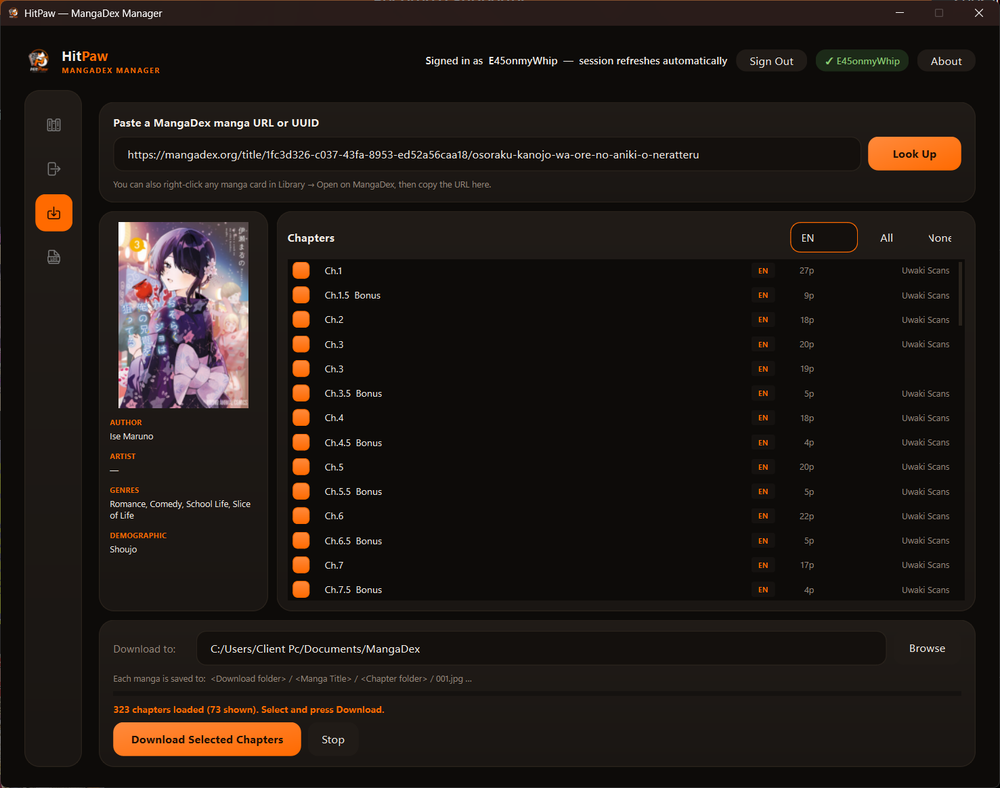

# HitPaw MangaDex Manager

A desktop app for browsing, filtering, and exporting your MangaDex library — built with Qt6/C++.

> Not affiliated with or endorsed by MangaDex.

## Preview

## Features

- Sign in with your MangaDex account (username/password or a personal API client)
- Browse your full library as a cover grid, with fast filtering/search
- Bulk-select and export titles (with undo)
- Export to CSV, JSON, MAL-compatible XML (works for MyAnimeList/AniList/MangaBaka/Kitsu/MangaFire), and Anime-Planet's gzipped XML
- Cover caching with disk-backed CDN retry/backoff, so re-opening the app is fast
- Dark AMOLED-style UI throughout

## Download

Grab the latest build from the [Releases](../../releases) page:

| Platform | File | Notes |
|----------|------|-------|
| **Windows** | `HitPaw-MangaDex-Manager-v*-Windows.zip` | Extract and run `MangaDexExporter.exe` |
| **macOS** | `HitPaw-MangaDex-Manager-v*-macOS.dmg` | Open the DMG and drag to Applications |
| **Linux** | `HitPaw-MangaDex-Manager-v*-Linux.tar.gz` | Extract and run `./MangaDexExporter` |

No install required on any platform. You don't need Qt or anything else on your machine.

## Setup

1. Launch the app and sign in with your MangaDex username/password.
2. You'll also need a personal API client ID & secret — MangaDex issues these for free. Get one at **MangaDex → Settings → API Clients**, then paste it into the app's login screen.
3. Click **Load Library** once signed in.

Your credentials are stored locally on your machine (via Qt's `QSettings`) and are never sent anywhere except MangaDex's own API.

## Export formats & site compatibility

| Format          | File                              | Compatible sites                                                          |
|-----------------|------------------------------------|-----------------------------------------------------------------------------|
| CSV             | `mangadex_library.csv`            | Excel, Google Sheets, any spreadsheet                                     |
| JSON            | `mangadex_library.json`           | Raw backup, scripting (includes cover URLs)                               |
| MAL XML         | `mangadex_library_MAL.xml`        | MyAnimeList, AniList, MangaBaka, Kitsu, MangaFire                         |
| AP .gz          | `mangadex_library_AP.xml.gz`      | Anime-Planet (requires the gzipped file specifically)                     |
| MB JSON         | `mangadex_library_MangaBaka.json` | MangaBaka's native import format (mangabaka.org/settings/import)          |

### Import instructions per site

| Site            | How to import                                                              |
|-----------------|------------------------------------------------------------------------------|
| MyAnimeList     | Profile → Import/Export → MyAnimeList Import → upload MAL XML             |
| AniList         | Settings → Import → upload MAL XML                                        |
| MangaBaka       | Settings → Import → MyAnimeList → upload MAL XML                          |
| Kitsu           | Avatar → Settings → Import → upload MAL XML                               |
| MangaFire       | Profile → Import/Export → upload MAL XML                                  |
| Anime-Planet    | Your manga list page → scroll to bottom → "Import it now" → upload AP .gz |

> MangaUpdates has no list import feature (export only). comix.to uses collections with no file-based import.

## Community

Join the Discord for support, suggestions, and updates: **https://discord.gg/z6yYYpcYYc**

## License

MIT — see [LICENSE](LICENSE).
