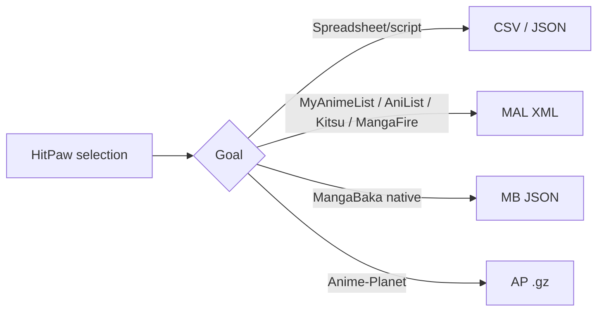

# Export Formats

One selection → six validated files. HitPaw checks headers, XML well-formedness, and gz magic before saving.

<div class="badge-row">
  <span class="badge badge--accent">CSV</span>
  <span class="badge badge--accent">JSON</span>
  <span class="badge badge--accent">MAL XML</span>
  <span class="badge badge--accent">AP .gz</span>
  <span class="badge badge--accent">MangaBaka JSON</span>
  <span class="badge badge--muted">Validated in app + ctest</span>
</div>

## At a glance

| Format | File | Use | Compatible sites |
|--------|------|-----|------------------|
| **CSV** | `mangadex_library.csv` | Spreadsheet backup | Excel, Google Sheets, Numbers |
| **JSON** | `mangadex_library.json` | Raw backup, scripting | Any editor — includes `coverUrl`, `year`, `tags`, `status` |
| **MAL XML** | `mangadex_library_MAL.xml` | Universal manga list | **MyAnimeList • AniList • MangaBaka • Kitsu • MangaFire** |
| **AP .gz** | `mangadex_library_AP.xml.gz` | Anime-Planet’s required gzip | **Anime-Planet** (must be `.gz`) |
| **MB JSON** | `mangadex_library_MangaBaka.json` | MangaBaka native | `mangabaka.org/settings/import` |

> MangaUpdates has **no** list import (export only). comix.to uses collections with no file import.

## Import — step by step

| Site | How to import your HitPaw file |
|------|--------------------------------|
| **MyAnimeList** | Profile → *Import/Export* → *MyAnimeList Import* → upload **MAL XML** |
| **AniList** | Settings → *Import* → upload **MAL XML** |
| **MangaBaka** | Settings → *Import* → *MyAnimeList* → upload **MAL XML** (also supports its own **MB JSON**) |
| **Kitsu** | Avatar → *Settings* → *Import* → upload **MAL XML** |
| **MangaFire** | Profile → *Import/Export* → upload **MAL XML** |
| **Anime-Planet** | Your manga list page → scroll to bottom → *“Import it now”* → upload **AP .gz** (not plain XML) |

::: tip Anime-Planet
They require the gzipped file **specifically**. HitPaw’s `*_AP.xml.gz` has gzip magic `1f 8b` + decompressed MAL XML inside — verified via `gzopen` in `export.h`.
:::

## File samples

::: code-group

```csv [CSV — mangadex_library.csv]
title,status,year,tags,coverUrl,mangaId
"One Piece",reading,1997,"adventure,shounen",https://uploads.mangadx...,8a3c...
"Solo Leveling",completed,2018,"action,adventure",https://...,d8...
```

```json [JSON — mangadex_library.json]
{
  "schema_version": 1,
  "exported_at": "2026-08-27T18:00:00Z",
  "titles": [
    {
      "title": "One Piece",
      "status": "reading",
      "year": 1997,
      "tags": ["adventure","shounen"],
      "coverUrl": "https://uploads.mangadex.org/...",
      "mangaId": "8a3c..."
    }
  ]
}
```

```xml [MAL XML — mangadex_library_MAL.xml]
<?xml version="1.0" encoding="UTF-8"?>
<myanimelist>
  <myinfo>
    <user_id></user_id><user_name></user_name>
    <user_total_manga>3276</user_total_manga>
    <user_total_reading>143</user_total_reading>
  </myinfo>
  <manga>
    <series_title><![CDATA[One Piece]]></series_title>
    <series_type>Manga</series_type>
    <my_status>Reading</my_status>
    <my_score>0</my_score>
    <manga_num_chapters>0</manga_num_chapters>
    <manga_num_volumes>0</manga_num_volumes>
  </manga>
</myanimelist>
```

:::

`MB JSON` is MangaBaka’s own `entries: [...]` schema (`export.h` → `toMangaBakaJson()`).

## Validation — before you leave HitPaw

The app runs `validateExportFile()` after every export (`main.cpp:3726`) and shows green `Validated — OK` or red `Validation failed`:

- **CSV** → header contains `title,status,year,tags` + line count = selected/all + 1
- **JSON** → must parse as array/object, `schema_version` present, UTF-8
- **MAL XML** → well-formed via `QXmlStreamReader`, count `manga` nodes vs `user_total_manga`
- **AP .gz** → gzip magic + `gzopen` decompress + XML check
- **MB JSON** → `entries` array size matches selection

CI also checks: `tests/test_export.cpp` (`ctest` → `CSV header` + `JSON valid UTF-8`). If validation fails, HitPaw aborts save and shows a `QMessageBox::warning`.

## Which file for which site?



## Source

Header-only `export.h` — uses `QJsonDocument`, `QXmlStreamReader`, `QCsv` helpers, `gzopen` for AP. Tests in `tests/test_export.cpp`. See [Building](/building) for `ctest` command.

::: info Need help?
If an import fails on a site, re-validate in HitPaw (green log line) and try the other compatible file (e.g., MAL XML vs MB JSON on MangaBaka). Still stuck? Open a [bug report](https://github.com/Hit-Paw/HitPaw-MangaDex-Manager/issues/new?template=bug_report.yml) with the file header (first 3 lines) and site error screenshot — no private titles needed.
:::
