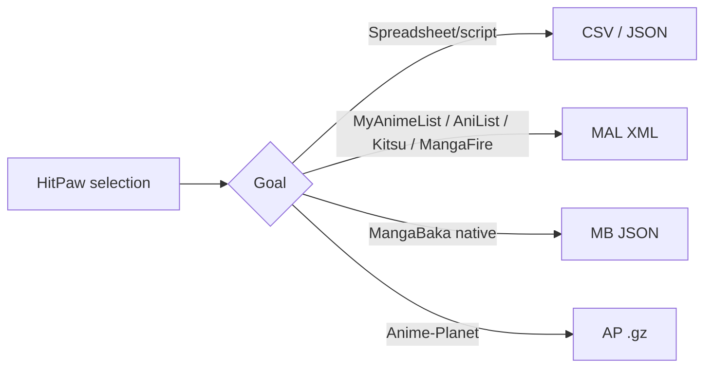

# Export Formats

One selection → five validated files. HitPaw checks headers, XML well-formedness, and gz magic before saving.

<div class="badge-row">
  <span class="badge badge--accent">CSV</span>
  <span class="badge badge--accent">JSON</span>
  <span class="badge badge--accent">MAL XML</span>
  <span class="badge badge--accent">AP .gz</span>
  <span class="badge badge--accent">MangaBaka JSON</span>
</div>

## At a glance

| Format | File | Compatible sites |
|--------|------|------------------|
| **CSV** | `mangadex_library.csv` | Excel, Google Sheets, Numbers |
| **JSON** | `mangadex_library.json` | Any editor — includes cover URLs, tags, status |
| **MAL XML** | `mangadex_library_MAL.xml` | **MyAnimeList • AniList • MangaBaka • Kitsu • MangaFire** |
| **AP .gz** | `mangadex_library_AP.xml.gz` | **Anime-Planet** (must be `.gz`) |
| **MB JSON** | `mangadex_library_MangaBaka.json` | **MangaBaka** native import |

> MangaUpdates has no list import (export only).

## Import — step by step

| Site | How to import |
|------|---------------|
| **MyAnimeList** | Profile → Import/Export → MyAnimeList Import → upload **MAL XML** |
| **AniList** | Settings → Import → upload **MAL XML** |
| **MangaBaka** | Settings → Import → MyAnimeList → upload **MAL XML** (or its own **MB JSON**) |
| **Kitsu** | Avatar → Settings → Import → upload **MAL XML** |
| **MangaFire** | Profile → Import/Export → upload **MAL XML** |
| **Anime-Planet** | Manga list page → scroll to bottom → "Import it now" → upload **AP .gz** |

::: tip Anime-Planet
They require the gzipped file specifically. HitPaw's `*_AP.xml.gz` has gzip magic + decompressed MAL XML inside.
:::

## File samples

::: code-group

```csv [CSV]
title,status,year,tags,coverUrl,mangaId
"One Piece",reading,1997,"adventure,shounen",https://...,8a3c...
"Solo Leveling",completed,2018,"action,adventure",https://...,d8...
```

```json [JSON]
{
  "schema_version": 1,
  "exported_at": "2026-08-27T18:00:00Z",
  "titles": [
    {
      "title": "One Piece",
      "status": "reading",
      "year": 1997,
      "tags": ["adventure","shounen"],
      "coverUrl": "https://...",
      "mangaId": "8a3c..."
    }
  ]
}
```

```xml [MAL XML]
<?xml version="1.0" encoding="UTF-8"?>
<myanimelist>
  <myinfo>
    <user_total_manga>3276</user_total_manga>
  </myinfo>
  <manga>
    <series_title><![CDATA[One Piece]]></series_title>
    <series_type>Manga</series_type>
    <my_status>Reading</my_status>
  </manga>
</myanimelist>
```

:::

## Validation

HitPaw runs `validateExportFile()` after every export:

- **CSV** → header contains `title,status,year,tags` + correct line count
- **JSON** → valid parse, `schema_version` present, UTF-8
- **MAL XML** → well-formed via `QXmlStreamReader`, node count matches
- **AP .gz** → gzip magic + `gzopen` decompress + XML check
- **MB JSON** → `entries` array size matches selection

CI also validates via `tests/test_export.cpp` (`ctest`).

## Which file for which site?



::: info Need help?
If an import fails, re-validate in HitPaw and try the other compatible file. Still stuck? Open a [bug report](https://github.com/Hit-Paw/HitPaw-MangaDex-Manager/issues/new?template=bug_report.yml).
:::
